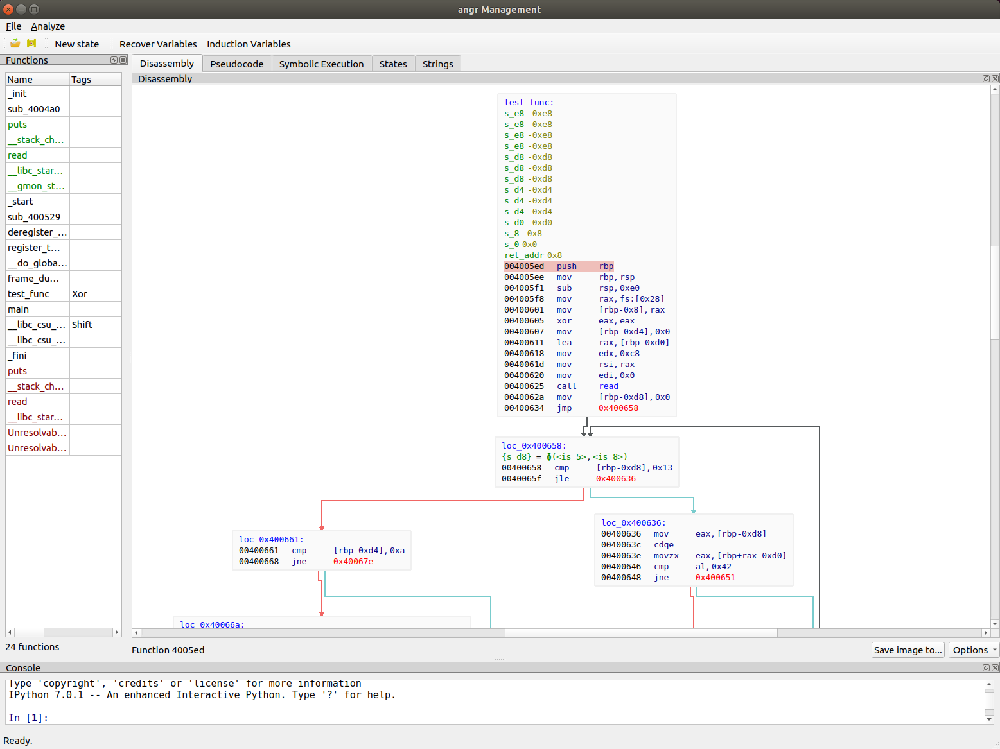
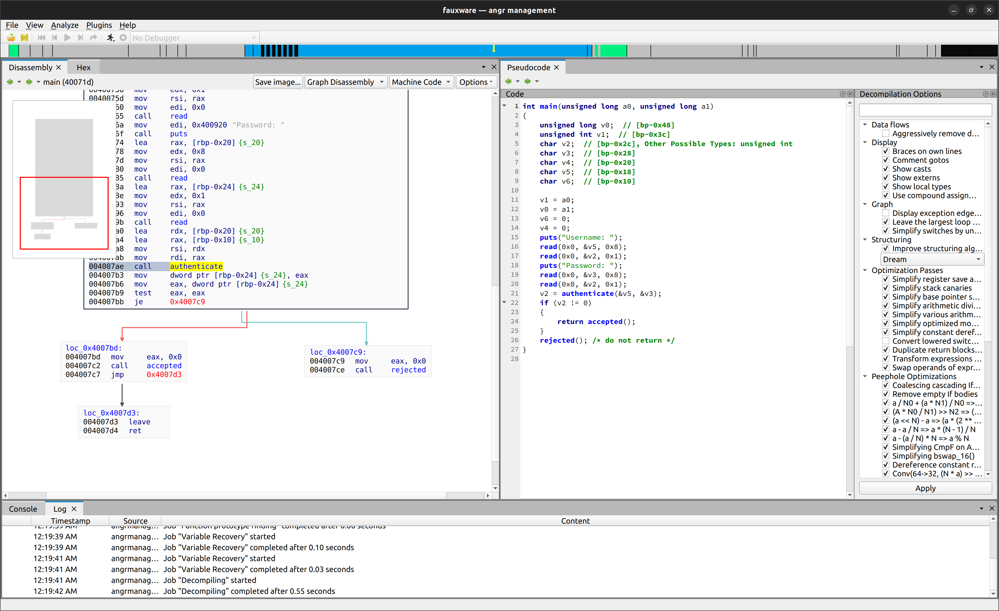

# angr Management
[](https://github.com/psf/black)

This is the GUI for angr.
Launch it and analyze some binaries!

Some screenshots:

[](https://github.com/angr/angr-management/blob/master/screenshots/disassembly.png)
[](https://github.com/angr/angr-management/blob/master/screenshots/decompilation.png)

## Installation

### Portable, pre-built executable

The easiest way to run angr-management is by grabbing a bundled release here: https://github.com/angr/angr-management/releases

"Onefile" builds can be placed and run from anywhere.
Non-onefile builds must be extracted and then the `angr-management` binary can be run from the extracted directory.

### From PyPI

To install angr-management, use pip:

```
pip install angr-management
```

angr-management can then be run with the command `angr-management`.

### Development Install

See [angr-dev](https://github.com/angr/angr-dev) for how to set up a development environment for the angr suite.
angr-management is included by default and checked out to `angr-management` directory.
If you encounter dependency issues, re-running `setup.sh` or `setup.bat` from angr-dev will ensure all dependencies are installed.

angr-management can then be run with `angr-management` or `python start.py`.

**FLIRT signatures**: For now, please manually clone FLIRT signatures by running `git clone --recurse-submodules https://github.com/angr/angr-management`, which will clone the `flirt_signatures` submodule.

## Usage

### Shortcuts
- Load a new binary: ```Ctrl+O```
- Load a new Docker Image ```Ctrl+Shift+O```
- Load a Trace File ```Ctrl+Shift+T```
- Save angr database... : ```Ctrl+S```
- Save angr database as... : ```Ctrl+Shift+S```
- Decompile: ```F5```
- Documentation: ```Alt+H```

- Next Tab: ```Ctrl+Tab```
- Previous Tab: ```Ctrl+Shift+Tab```

## Plugins

Plugins may be installed by placing a subdirectory under `plugins`. The directory must contain an `__init__.py` like that in `TestPlugin`:
```
from .test_plugin import TestPlugin
PLUGIN_CLS_NAME = TestPlugin.__name__
```

This also allows you to import a plugin class from another package entirely. The plugin itself should inherit from `BasePlugin`. Callbacks and events are a work in progress, so the API is subject to change. See `TestPlugin` for an example of a multithreaded plugin sample.

## Scripting

Take a look at https://docs.angr.io/extending-angr/angr_management!
